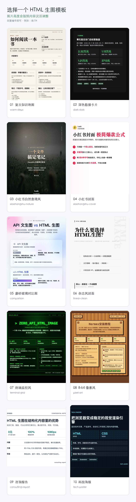
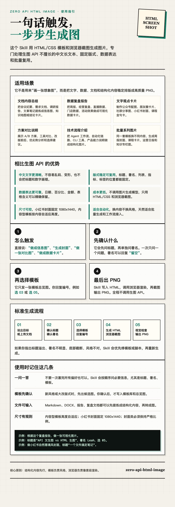

# zero-api-html-image

用 HTML/CSS 模板和浏览器截图生成中文视觉图片的 Codex skill。不调用生图 API，适合把结构化内容稳定地渲染成可复用、可审查、可迁移的图片。

## 适合场景

- 总结文档内容，生成可读性强的图文卡片
- 生成可视化数据复盘报告、经营分析图、对比图
- 制作小红书封面、文字卡片、知识地图、咨询报告页
- 在 Codex、Hermes、OpenClaw、云端部署环境中复用同一套模板

## 相比生图 API 的优势

- 文字可控，不容易出现错字、变形和排版漂移
- HTML/CSS 模板可维护、可复用、可审查
- 不依赖生图模型，成本低，适合批量生成
- 浏览器截图链路通用，适合本地和云端部署

## 模板总览



## 如何使用



## 快速开始

下载或克隆仓库后，进入 skill 目录运行：

```bash
python3 quick_validate.py
python3 scripts/doctor.py
```

生成图片时遵循 `SKILL.md` 的交互规则：

- 每次生成图片前先单独确认标题，再单独确认署名
- 选择模板时只展示 `assets/demos/template-gallery.png`，让用户回复编号
- 新模板或大改模板时，先生成候选图给用户确认，确认后再写入模板库
- 内容型模板高度自适应，小红书封面类固定 `1080x1440`
- 生成图必须检查标题不溢出、署名可见、底部不能截断或贴边

## 目录结构

```text
assets/templates/      HTML/CSS 模板
assets/demo-data/      模板演示数据
assets/demos/          模板演示图和总览图
assets/images/         模板依赖图片
scripts/               渲染、总览图构建、环境检查脚本
docs/                  部署说明和使用说明图
agents/                Agent/Skill 注册示例
```

## 跨环境部署

这个 skill 只依赖通用浏览器截图能力，不硬编码 Codex 独有浏览器 API。部署到 Hermes、OpenClaw、云端运行环境时，重点确认：

- Python 依赖可安装
- Chromium 或可用浏览器存在
- 渲染脚本可创建临时文件并输出 PNG
- 中文字体可用或已配置字体回退

更详细说明见 `docs/DEPLOYMENT.md` 和 `docs/OPENCLAW_LOBSTER.md`。
